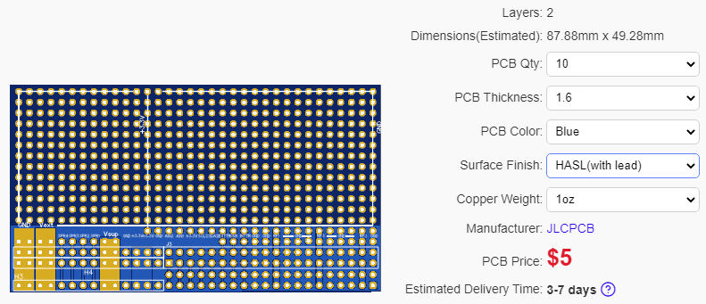
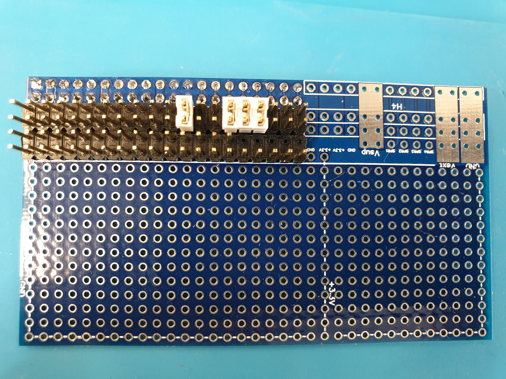
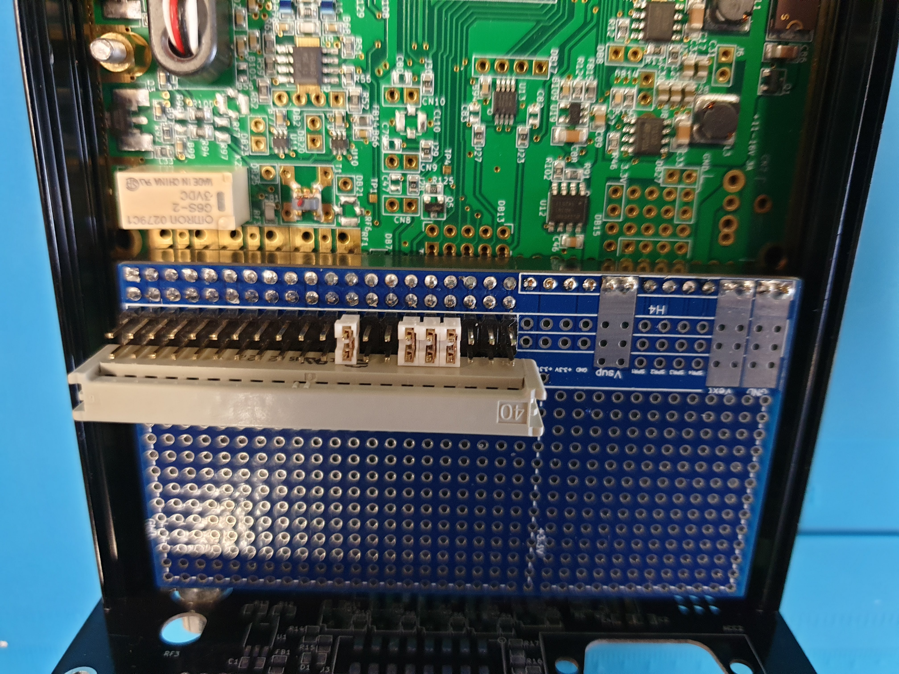
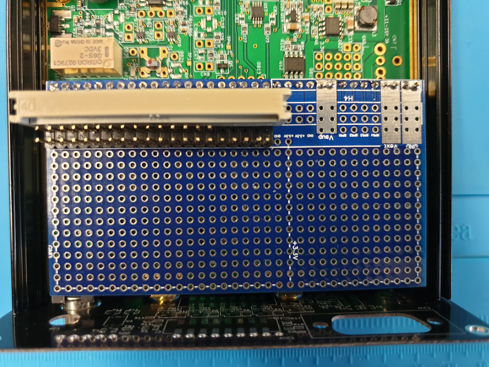
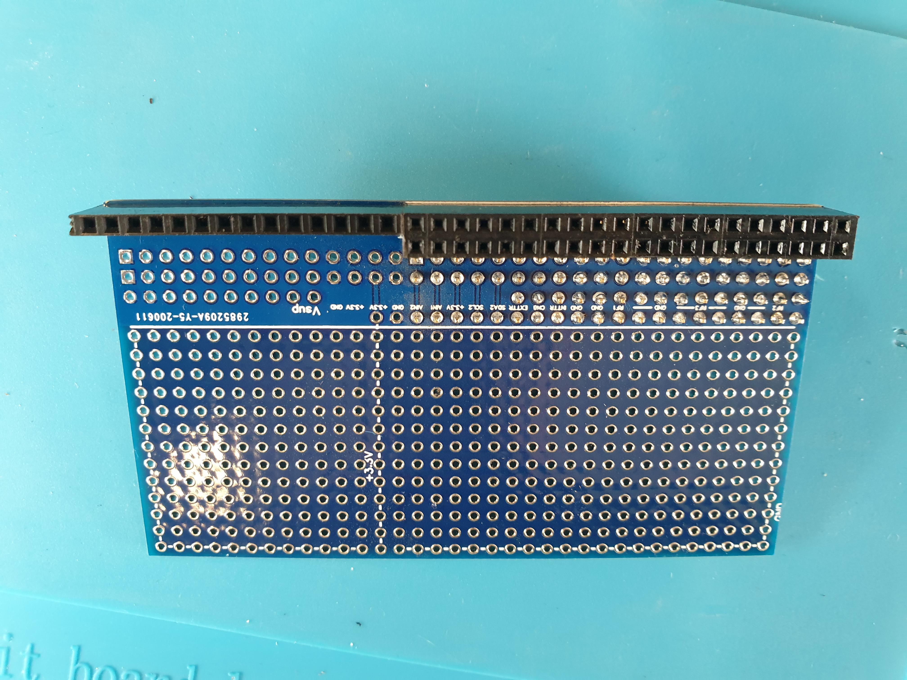
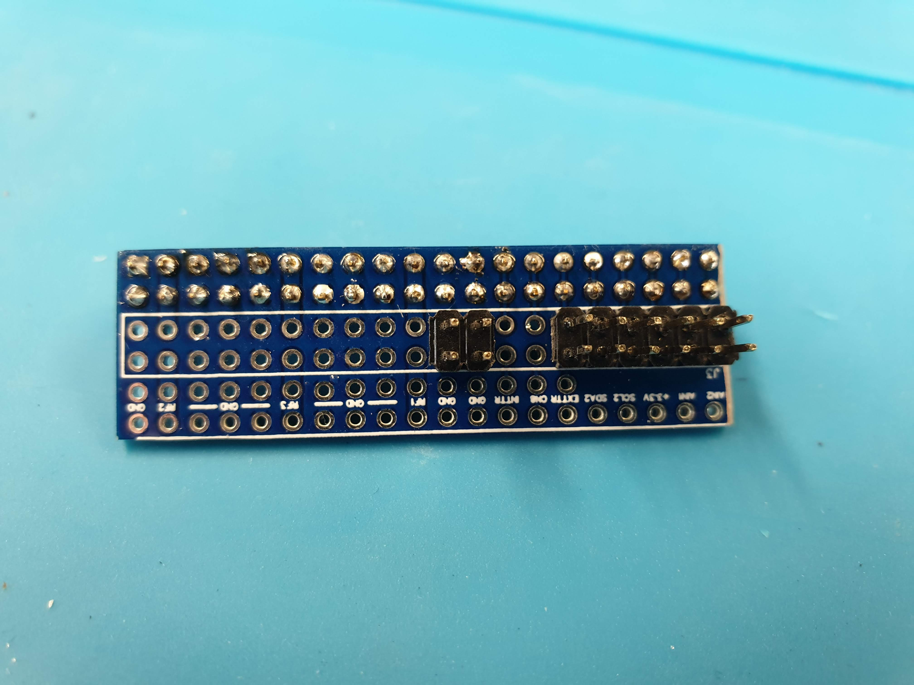
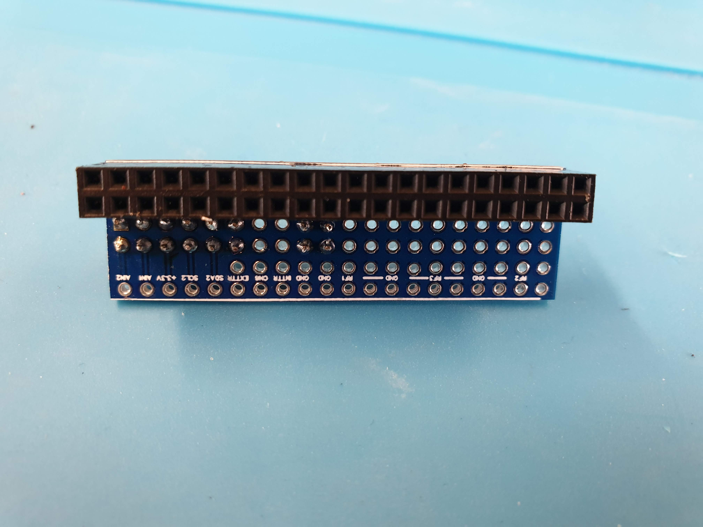
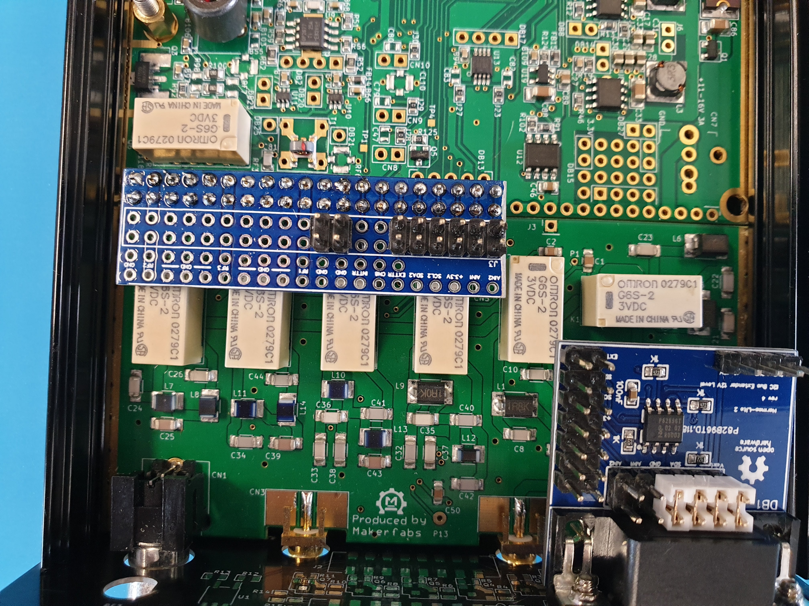
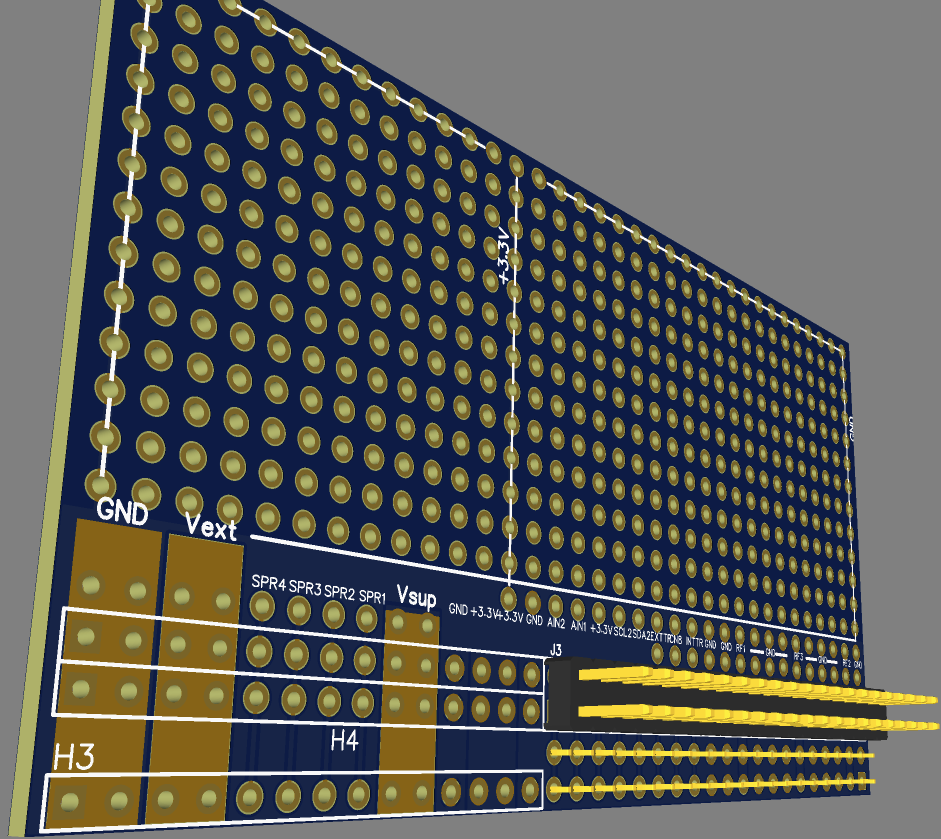
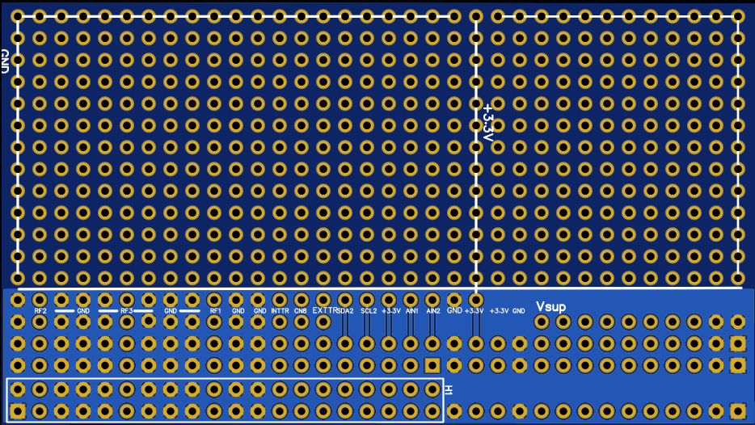

# HL2_Extension_Jumper
flexible breadboard for HL2 extension experiments or connections to extension boards by flat ribbon

This pcb is multi purpose to play with Hermes-Lite 2 extensions, connect to external boards,etc. 

It designed to be cut for different purpose, since each PCB at JLCPCB costs the same 5$ and you have to take 10 pcs. Therefore one design and cut with the dremel at home for purpose.

1. it serves as Jumper for the filter board to connect N2ADR
2. Allows to switch individual extensions to the secondary header to avoid i.e. all RF connected to other boards because of 40pin header takes them all
3. breadboard for through hole experiments

You can simply upload the gerber files in the folder [**"gerber"**](https://github.com/pressla/HL2_Extension_Jumper/tree/master/gerber) or go to easyeda online editor, the full project is open to you for cloning, making changes and order directly from that tool at JLCPCB. You will get an online quote when pressing the "create gerber" button in the pcb view.

### [Link to EasyEDA Project](https://bit.ly/3dDbFP3)

[All pictures are here](https://github.com/pressla/HL2_Extension_Jumper/tree/master/pics)

------

### Sample use cases

The second double row next to the extension connector is splitting the signals. This means you can either put direct a flat ribbon connector on this header, or as seen in picture jumper a few signals to the third double row header where you put your connector on, or go the breadboard.

The jumpers are an extra flexibility. of course one can solder also the wire here.

In this picture SDA2,SCL2,3v3,GND are the ones jumpered to the third double row.

### Full Connector

### Or a minimal connector

------

### Design image from easyeda:

